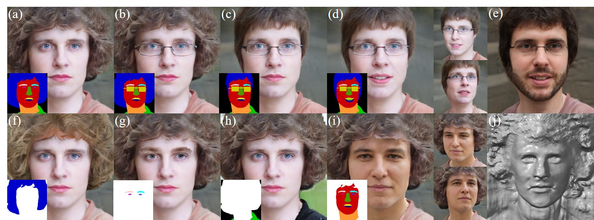

# IDE-3D: Interactive Disentangled Editing for High-Resolution 3D-aware Portrait Synthesis</sub>



**IDE-3D: Interactive Disentangled Editing for High-Resolution 3D-aware Portrait Synthesis**<br>
Jingxiang Sun, Xuan Wang, Yichun Shi, Lizhen Wang, Jue Wang, Yebin Liu<br>
<br>
https://mrtornado24.github.io/IDE-3D/<br>

Abstract: *Existing 3D-aware facial generation methods face a dilemma in quality versus editability: they either generate editable results in low resolution or high-quality ones with no editing flexibility. In this work, we propose a new approach that brings the best of both worlds together. Our system consists of three major components: (1) a 3D-semantics-aware generative model that produces view-consistent, disentangled face images and semantic masks; (2) a hybrid GAN inversion approach that initialize the latent codes from the semantic and texture encoder, and further optimized them for faithful reconstruction; and (3) a canonical editor that enables efficient manipulation of semantic masks in canonical view and product high-quality editing results. Our approach is competent for many applications, e.g. free-view face drawing, editing, and style control. Both quantitative and qualitative results show that our method reaches the state-of-the-art in terms of photorealism, faithfulness, and efficiency.*

## Citation

```
@inproceedings{sun2022ide3d,
    title={IDE-3D: Interactive Disentangled Editing for High-Resolution 3D-aware Portrait Synthesis},
    author={Jingxiang Sun and Xuan Wang and Yichun Shi and Lizhen Wang and Jue Wang and Yebin Liu},
    booktitle = {arXiv},
    year={2022},
   
}
```

